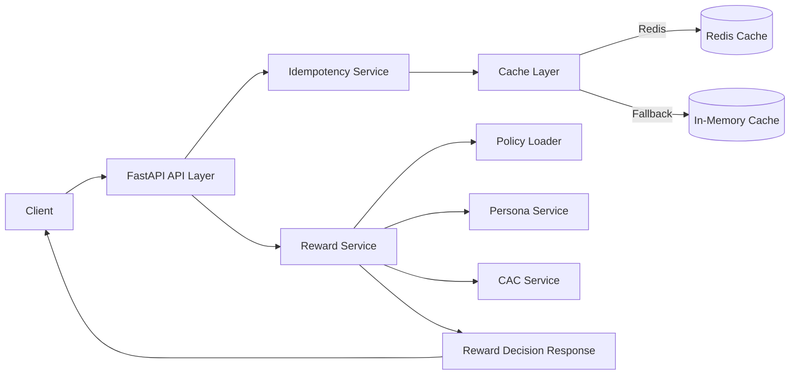

# Reward Decision Service

A FastAPI-based microservice that deterministically decides rewards for user transactions.  


## Architecture Overview



---

## Project Structure

```
reward-decision-service
│
├── app
│   ├── main.py
│   ├── api
│   │   └── reward.py
│   ├── core
│   │   └── cache.py
│   ├── models
│   │   ├── request.py
│   │   └── response.py
│   ├── policies
│   │   └── policy_loader.py
│   └── services
│       ├── reward_service.py
│       ├── idempotency_service.py
│       ├── persona_service.py
│       └── cac_service.py
│
├── config
│   └── reward_policy.yaml
│
├── data
│   └── personas.json
│
├── tests
│   ├── test_reward_logic.py
│   └── test_idempotency.py
│
├── load_test
│   └── locustfile.py
│
├── requirements.txt
└── README.md
```

---

# Setup

## 1 Install Dependencies

```bash
pip install -r requirements.txt
```

## 2 Run Service

```bash
uvicorn app.main:app --reload
```

API available at:

```
http://127.0.0.1:8000/docs
```

---

# API Contract

## POST /reward/decide

### Request

```json
{
  "txn_id": "txn1",
  "user_id": "user1",
  "merchant_id": "m1",
  "amount": 100,
  "txn_type": "PAYMENT",
  "ts": 123456
}
```

### Response

```json
{
  "decision_id": "uuid",
  "policy_version": "v1",
  "reward_type": "XP",
  "reward_value": 0,
  "xp": 200,
  "reason_codes": [],
  "meta": {
    "persona": "NEW"
  }
}
```

---

# Idempotency

The API ensures **idempotent responses**.

Idempotency Key:

```
txn_id + user_id + merchant_id
```

If the same request is sent again, the cached response is returned.

---

# Policy Driven Rewards

Rewards are defined via YAML configuration.

Example:

```
xp_per_rupee: 2
max_xp_per_txn: 500
persona_multipliers:
  NEW: 1.5
  RETURNING: 1.0
  POWER: 2.0
```

This enables changing reward behavior **without code changes**.

---

# Caching Strategy

Primary cache: **Redis**

Fallback: **In‑memory Python dictionary**

Cache keys:

```
idem:{txn_id}:{user_id}:{merchant_id}
persona:{user_id}
cac:{user_id}:{date}
```

---

# Testing

Run tests:

```bash
pytest
```

Tests include:

- Reward logic
- Idempotency behavior

---

# Load Testing

Run Locust:

```bash
locust -f load_test/locustfile.py
```

Target performance:

```
~300 requests/sec locally
```

Metrics to monitor:

- p95 latency
- p99 latency

---


Author: Don Joy
