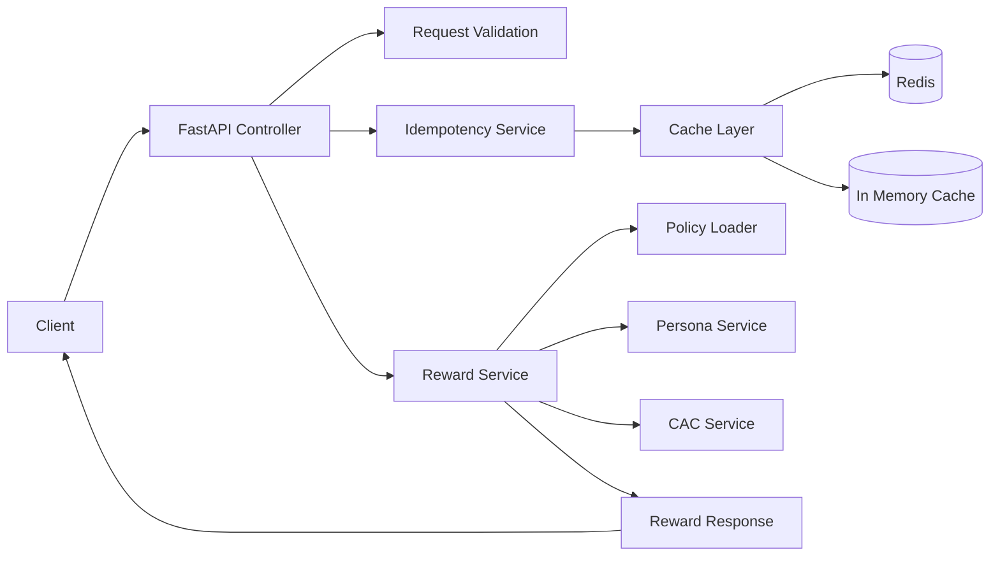

# Reward Decision Service 

FastAPI microservice that returns deterministic reward decisions for transactions.

## Features

- FastAPI REST API
- Request validation using Pydantic
- Global error handling
- Idempotent request handling
- Redis cache with in‑memory fallback
- Persona based rewards
- Daily CAC cap enforcement
- Unit tests
- Load testing

---

## Architecture

